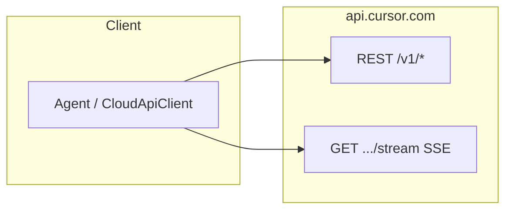
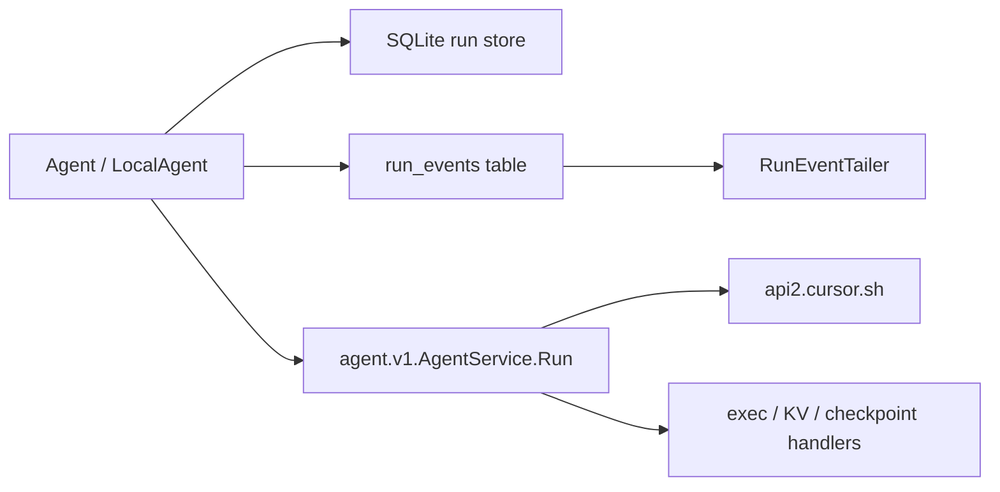

# Architecture — Cursor Agent SDK

## Runtimes

The TypeScript SDK supports two execution surfaces:

1. **Cloud agents** — User/API-key scoped agents on Cursor infrastructure. Wire protocol: **HTTPS JSON** (`CURSOR_BACKEND_URL` / default `https://api.cursor.com`) plus **Server-Sent Events** for run output. Agent IDs used for cloud routing are prefixed with `bc-` (e.g. `bc-<uuid>` from `crypto.randomUUID()` in the bundle).

2. **Local agents** — Agent runs against a local checkout using bundled **Connect-RPC** clients over HTTP/2 to Cursor backends, plus local persistence (`@anysphere/cursor-sdk-local-runtime`). The Python reference implements the local store/run-event scaffolding **and** a native Connect `AgentService.Run` executor (HTTP/2 bidi, with HTTP/1.1 `RunSSE` + `BidiAppend` fallback; no Node bridge), including in-process `webFetch` / MCP, server-side `webSearch` (the client only approves), custom subagents via `task` (nested `Run` / `RunSSE`), shell-command analysis via `tree-sitter` / `tree-sitter-bash`, optional filesystem sandboxing via the vendor `cursorsandbox` CLI, and `readLints` diagnostics from syntax checks plus optional CLI linters.

## Optional platform packages (`@cursor/sdk-*`)

Packages such as `@cursor/sdk-linux-x64` are **optionalDependencies**. They ship native/helper binaries (e.g. **ripgrep** for search-style tools, the `cursorsandbox` helper, and a vendored tree-sitter shell parser). They are **not** the main local agent core; the bulk of local agent logic remains inside the main `@cursor/sdk` bundle (protobuf + executor + local runtime modules). The Python reference uses PyPI `tree-sitter` + `tree-sitter-bash` for that shell-parse path, spawns `cursorsandbox` with the same `--policy` CLI contract as the TypeScript SDK when sandboxing is enabled, and spawns the same package’s `rg` binary for grep (`CURSOR_RIPGREP_PATH` or `@cursor/sdk-<platform>/bin/rg`; source/binaries at [anysphere/ripgrep](https://github.com/anysphere/ripgrep)). Reverse-engineering the sandbox helper itself is out of scope.

## Cloud request path

Typical flow: `POST /v1/agents` (create agent + first run) or `POST /v1/agents/{id}/runs` (follow-up), then `GET /v1/agents/{id}/runs/{runId}/stream` for SSE until a terminal `result` / `done` / error.

## Internal Connect-RPC (bundled, not cloud REST)

Used for analytics, dashboard-style APIs, and **local** agent streaming (`agent.v1.AgentService`). Base URL for token exchange and some clients defaults to `https://api2.cursor.sh` in the bundle (`CURSOR_BACKEND_URL` overrides for cloud REST point at `api.cursor.com`). See [connect-rpc/transport.md](connect-rpc/transport.md).

## Local request path

The TypeScript SDK creates a queued local run, opens `AgentService.Run` (HTTP/2 bidi) or falls back to `RunSSE` + `BidiAppend` (HTTP/1.1) with an `AgentRunRequest`, converts `InteractionUpdate` protobuf messages into JSON `SDKMessage` values, and persists those messages as local run events. The Python path speaks the same Connect protocol in-process (no `cursor-sdk-bridge`). Official Python `cursor_sdk` on PyPI is a **sync wrapper around that Node bridge** (`sdk.v1`); opencursor is not a port of `Client` / `Bridge`.

## Documentation depth

This doc set stays at **service map** level: REST paths and bodies, SSE event names, local run-event JSON envelopes, and RPC method names with request/response **message type names** as they appear in generated code — not a field-by-field protobuf dump.
